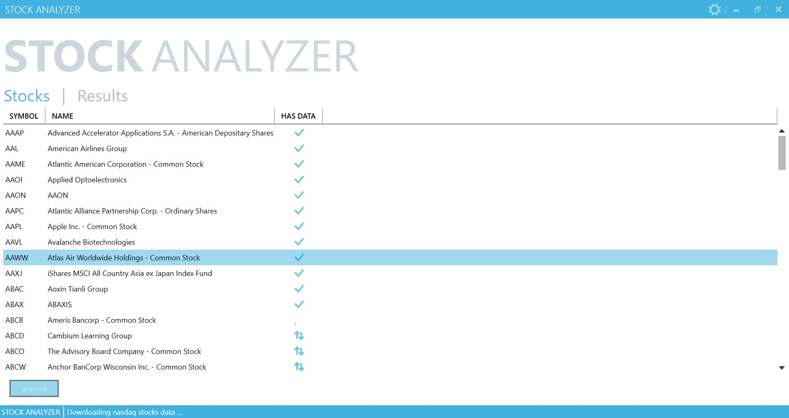

# Stock-Analyzer

This project is an end-to-end demo of stock analysis using big data & machine learning algorithms on top of hadoop.

Steps to run the application:
1. Configure the ssh propeties in the exe.config file
2. Run the application

3. Choose the settings for analysis
4. Click analyze and prepare to be amazed!!!
