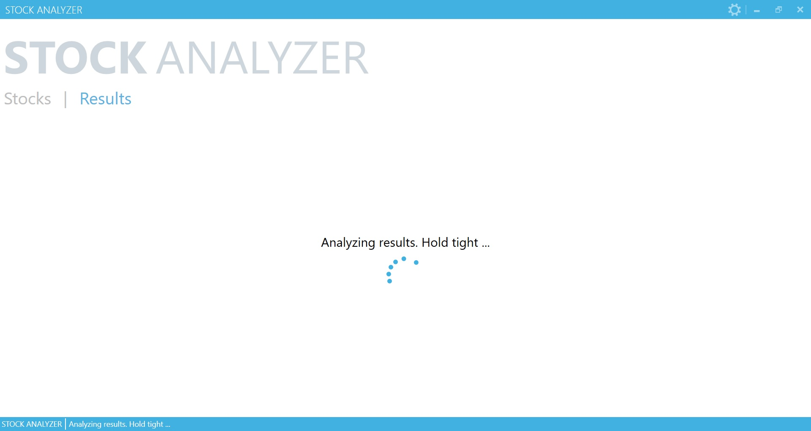
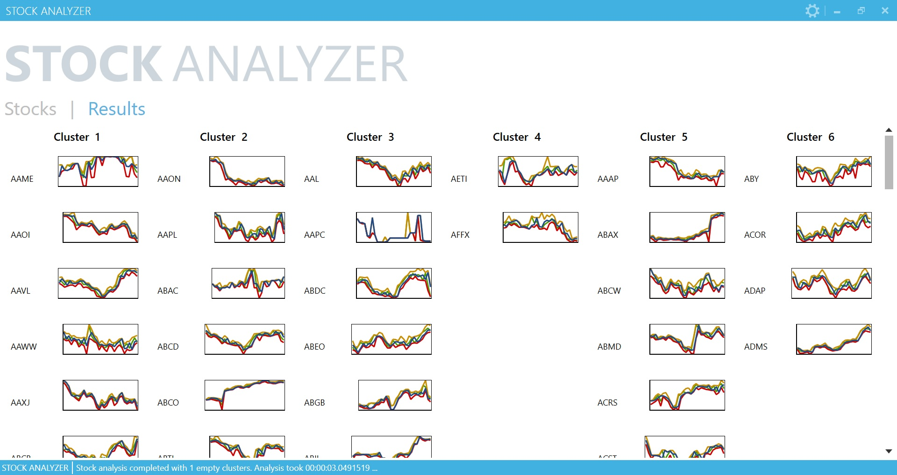

# Stock-Analyzer

This project is an end-to-end demo of stock analysis using big data & machine learning algorithms on top of hadoop.

Steps to run the application:

1. Configure the ssh propeties in the exe.config file

2. Run the application

Stocks data will start downloading automatically. Once this is finished, *Anaylze* button will be enabled

3. Choose the settings for analysis

4. Click analyze (This step could take some time depending the your cluster configuration) 

5. See the results :)

