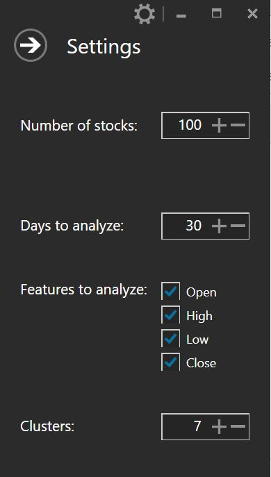

# Stock-Analyzer

This project is an end-to-end demo of stock analysis using big data & machine learning algorithms on top of hadoop.

Steps to run the application:

 Configure the ssh propeties in the exe.config file and run the application

Stocks data will start downloading automatically. Once this is finished, *Anaylze* button will be enabled.

Choose the settings for analysis

Click *Analyze* (This step could take some time depending the your cluster configuration) 

 See the results :)

